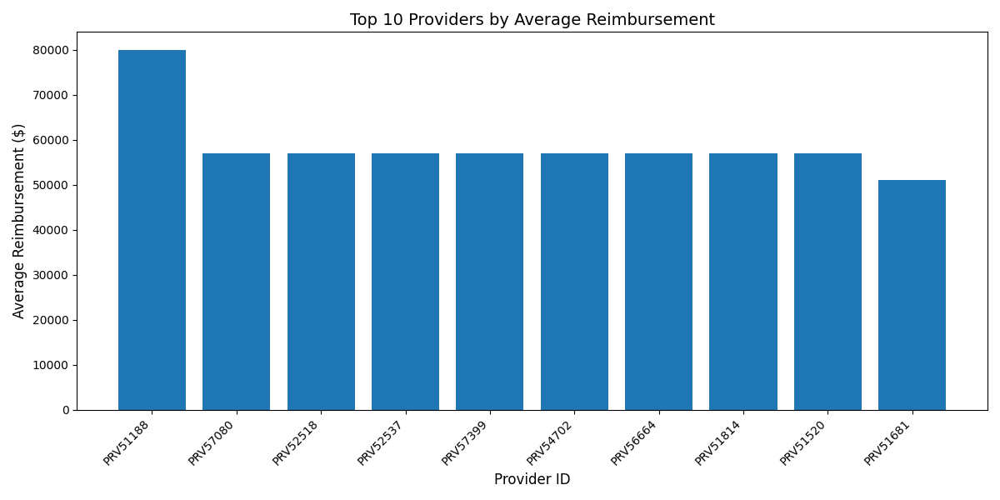
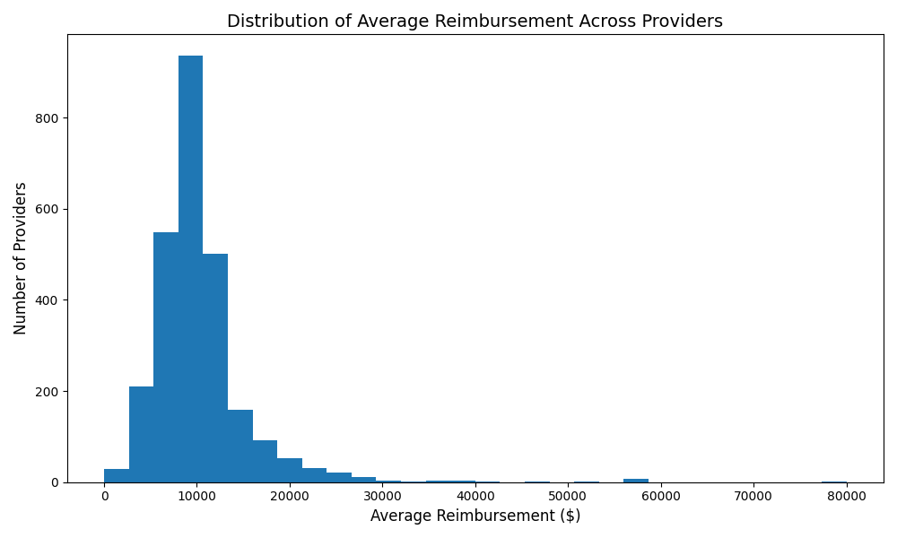
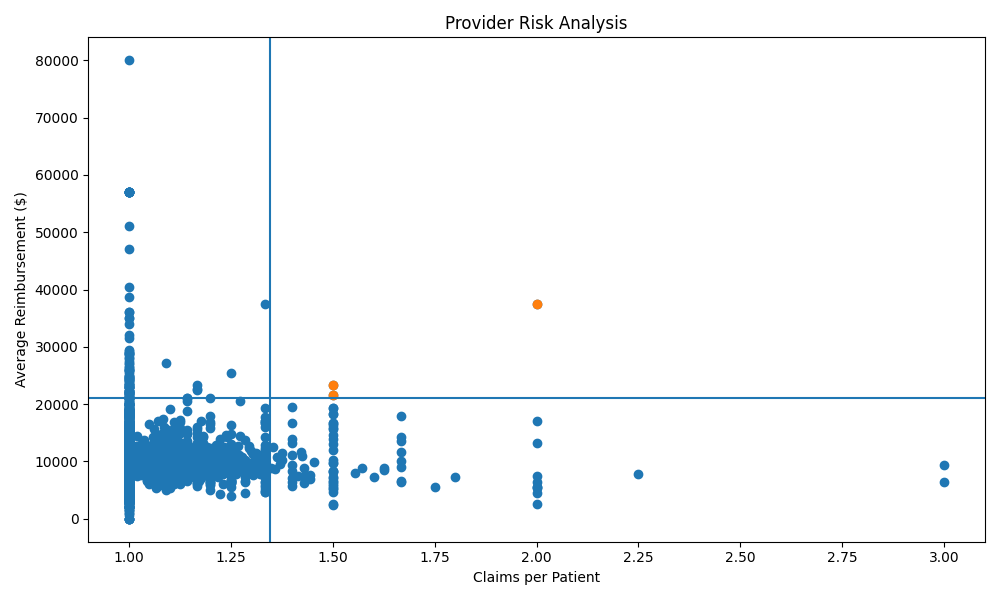

# Healthcare Claims Fraud Detection Analysis

## Overview
This project analyzes healthcare claims data to identify providers with potentially anomalous billing behavior. By aggregating claim-level data and applying statistical techniques, the analysis highlights providers whose patterns deviate significantly from the norm.

---

## Objective
To detect healthcare providers with unusual billing activity by analyzing:
- Average reimbursement per claim  
- Claims per patient  
- Combined risk indicators  

---

## Tools & Technologies
- Python  
- pandas  
- matplotlib  

---

## Dataset
The dataset used for this project contains healthcare claims data, including:
- Provider IDs  
- Claim reimbursement amounts  
- Patient identifiers  

*Note: Provider identities are anonymized.*

---

## Methodology

### 1. Data Preparation
- Combined training and test datasets  
- Cleaned and structured claim-level data  

### 2. Feature Engineering
Created provider-level metrics:
- **Average Reimbursement per Claim**
- **Total Claims**
- **Unique Patients**
- **Claims per Patient**

### 3. Outlier Detection
- Defined thresholds using standard deviation  
- Identified providers with unusually high reimbursement  

### 4. Risk Scoring
- Calculated z-scores for key metrics  
- Created a composite **risk score** to rank providers  

### 5. Visualization
- Bar chart of top providers  
- Distribution histogram  
- Scatter plot to identify multi-variable anomalies  

---

## Key Findings

- The distribution of reimbursement is **right-skewed**, with a small number of providers exhibiting significantly higher averages.  
- A subset of providers shows both:
  - High reimbursement per claim  
  - High claims per patient  

- These providers were flagged as **high-risk** and may represent anomalous billing behavior.

---

## Visualizations

### Top Providers by Average Reimbursement


### Distribution of Reimbursement


### Provider Risk Analysis


---

## Conclusion

This analysis identified a small group of providers with behavior that deviates significantly from the norm. By combining multiple metrics into a unified risk score, the project demonstrates how data analysis can be used to flag potentially suspicious activity for further investigation.

---

## Future Improvements

- Incorporate additional features (e.g., diagnosis codes, time trends)  
- Apply machine learning models for classification  
- Build an interactive dashboard (Tableau or Power BI)  

---

## Project Structure
```
healthcare-claims-analysis/
│
├── data/
├── images/
│ ├── top_providers.png
│ ├── distribution.png
│ ├── scatter.png
│
├── analysis.py
├── provider_summary.csv
├── suspicious_providers.csv
├── README.md
└── requirements.txt


---

## 📌 Author
Joshua DeBurr
