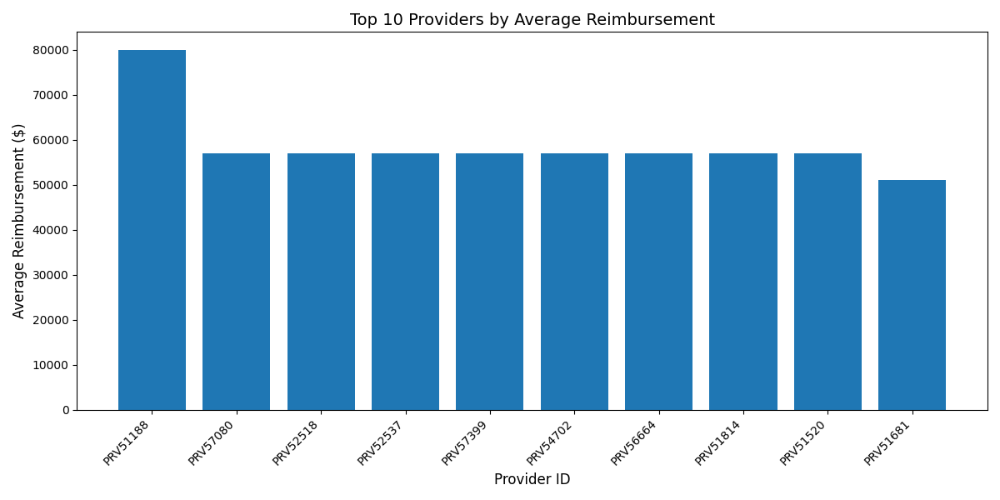
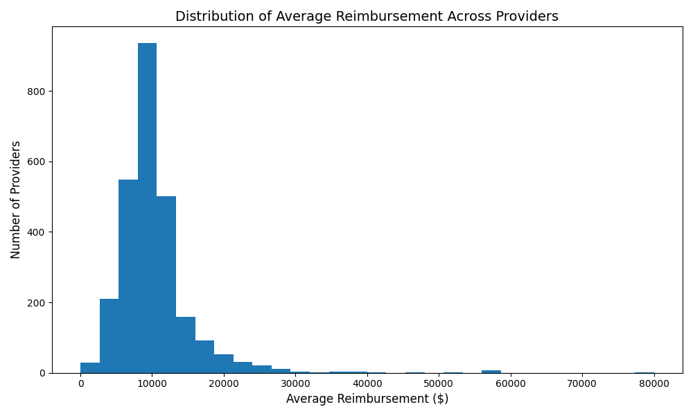
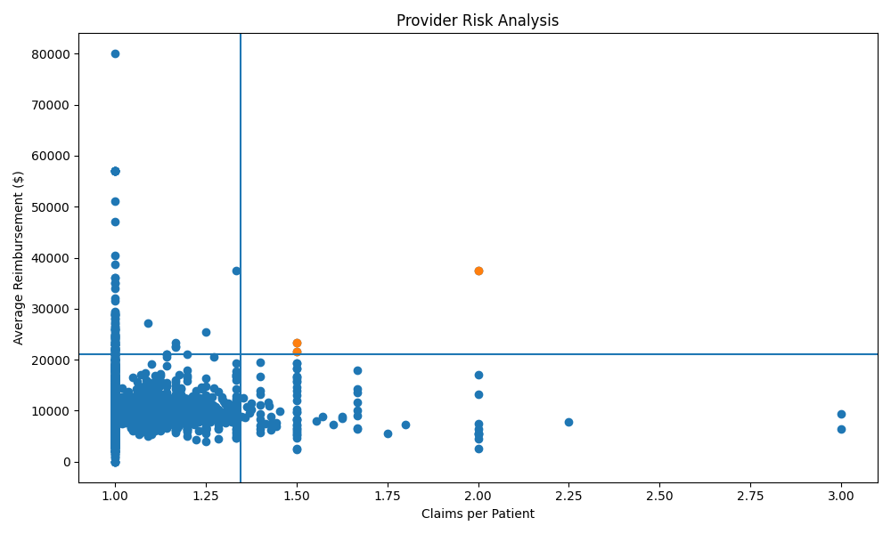

# Healthcare Claims Fraud Detection Analysis

## Overview
This purpose of this project is to analyze healthcare claims data to identify providers that have potentially abnormal billing behavior. By gathering and combining claim-level data and applying statistics techniques, the analysis highlights providers with patterns that deviates significantly from the norm.

---

## Objective
Figure out which healthcare providers have unusual billing activity by analyzing:
- Average reimbursement per claim  
- Claims per patient  
- Combined risk indicators  

---

## Tools & Technologies
- Python  
- pandas  
- matplotlib  

---

## Dataset
The dataset used for this project contains healthcare claims data, including:
- Provider IDs  
- Claim reimbursement amounts  
- Patient IDs 

*Note: Provider identities are anonymized.*

---

## Analysis

### 1. Data Preparation
- Combined training and test datasets  
- Cleaned and structured claim-level data  

### 2. Feature Engineering
Created provider-level metrics:
- **Average Reimbursement per Claim**
- **Total Claims**
- **Unique Patients**
- **Claims per Patient**

### 3. Outlier Detection
- Using standard deviation to establish thresholds  
- Identified providers with unusually high reimbursement  

### 4. Risk Scoring
- Calculated z-scores for key metrics  
- Created a composite **risk score** to rank providers  

### 5. Visualization
- Bar chart of top providers  
- Distribution histogram  
- Scatter plot to identify anomalies  

---

## Key Findings

- The reimbursement distribution is strongly **right-skewed**, with a small percentage of providers receiving substantially higher average reimbursements than the overall population.  
- A subset of providers shows both:
  - High reimbursement per claim  
  - High claims per patient  

- The analysis narrowed thousands of claim records down to a smaller group of providers that may warrant additional review.
- While these results don't prove fraudulent activity, they demonstrate how data analysis can be used to identify unusual billing patterns for further investigation.
  
---

## Visualizations







---

## Conclusion

This project demonstrates a practical approach to healthcare claims analysis using provider-level aggregation, statistical outlier detection, and risk scoring. The workflow can help prioritize providers for further review and serves as a foundation for more advanced fraud, waste, and abuse detection techniques.

---

## Future Improvements

- Incorporate additional features (e.g., diagnosis codes, time trends)  
- Apply machine learning models for classification  
- Build an interactive dashboard (Tableau or Power BI)  

---

## Project Structure
```
healthcare-claims-analysis/
│
├── data/
├── images/
│ ├── top_providers.png
│ ├── distribution.png
│ ├── scatter.png
│
├── analysis.py
├── provider_summary.csv
├── suspicious_providers.csv
├── README.md
└── requirements.txt

```
---

## 📌 Author
Joshua DeBurr
